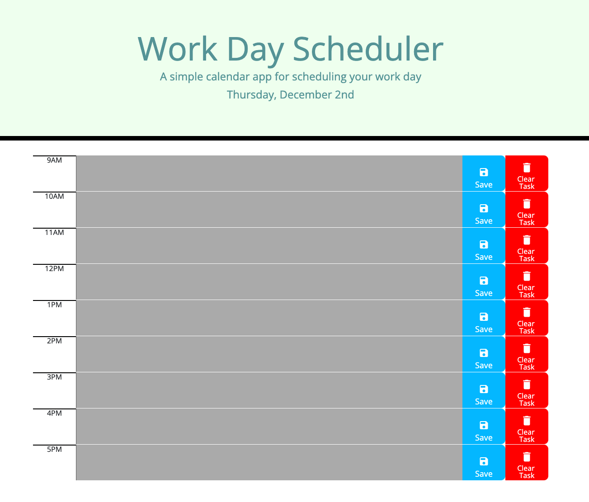

# Work Day Scheduler Starter Code

# Description

The work day scheduler is an online calendar that can be used to save daily tasks at various times throughout the work day. The scheduler provides the current day of the week and date, and then there is a calendar below with text areas for each hour of the work day from 9AM to 5PM. The user has the ability to type in any tasks they need to complete each day, and then they can save these tasks so if they close or reload the page the tasks will persist. If the user adds a task they no longer want or need on their calendar there is a clear task button to remove that task. The calendar also provides a color coding system that colors each time slot either grey, red, or green to indicate past, present, and future hourly tasks respectively. This color coding will constantly update without the user having to refresh the page. 

# Table of Contents
- [Built With](#built-with)
- [Code Access](#code-access)
- [Preview](#preview)
- [Functionality](#functionality)
- [Work Day Scheduler Link](#work-day-scheduler-link)
- [Credit / Contribution](#credit--contribution)

# Built With
- HTML
- CSS
- JavaScript
- JQuery
- Bootstrap
- Moment.js

# Code Access

If you would like to access this project's code, you will need to visit this [GitHub](https://github.com/sm3131/work-day-scheduler) repository. 

# Preview

Below is a screenshot of the Work Day Scheduler in the browser:

# Functionality

The work day scheduler has the following capabilities:

- It provides the user with the current day of the week and day of the month
- Time blocks for standard business hours (9AM-5PM) are provided below the page header
- Each time block has the hours of the day listed on the left side, a text area to record tasks in the middle, and two buttons on the right side
- The text area can easily be clicked on in order to allow the user to start typing their tasks for the corresponding hour
- The first button on the right side is a save button, which allows the user to save the task to local storage, so if they close or refresh the page the tasks that were saved will persist
The second button on the right is a clear task button which when clicked allows the user to both delete any tasks that were written in the corresponding time slot as well as delete the tasks from local storage
- Lastly during standard business hours the calendar will be color coded to indicate whether the time block is in past, present, or future 
- A grey color indicates that the time block is in the past
- A red time block indicates that the time block is the current hour
- A green time block indicates that the time block is in the future
- This color coding feature is meant to help the user visualize the urgency of specific daily tasks

# Work Day Scheduler Link

The link to the work day scheduler is provided below:
 
https://sm3131.github.io/work-day-scheduler/

# Credit / Contribution

This project contained starter code from ____________ which provided the html and css files. These files provided a general structure and style for the calendar but the majority of the html was created by myself, Sammi Moore. Also all of the javascript was created by myself. So ultimately all of the functionality was developed by me through the use of jQuery within javascript. The styling was also a combination of starter code css, my own css, and bootstrap. 